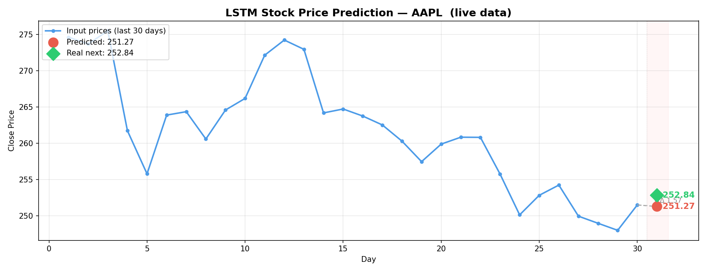

# S&P 500 Stock Price Forecasting (LSTM, PyTorch)

Двухслойная LSTM для предсказания цены закрытия акции на следующий день. Обучена на дневных ценах закрытия всех 505 компаний индекса S&P 500 (2013–2018, ~619 тыс. строк). На вход подаются последние 30 дней цены закрытия, на выходе — прогноз на следующий день. Проверена на живых рыночных данных через `yfinance`.

## Зачем этот проект

Большинство похожих проектов по прогнозированию акций обучаются на одном тикере и на этом останавливаются. Здесь модель обучена сразу на всех 505 тикерах S&P 500, чтобы она училась общим паттернам ценового движения, а не запоминала историю одной конкретной компании. Дальше модель проверяется на живых данных AAPL за 2025–2026 год, хотя обучалась только на данных 2013–2018 — разрыв в 8 лет — чтобы посмотреть, действительно ли выученные паттерны переносятся на новый период.

Также в проекте есть небольшое исследование влияния соотношения train/test на качество модели — этот момент часто опускают в похожих проектах, хотя он заметно влияет на итоговые метрики.

## Результаты

Модель обучена с разбиением 80/20, для сравнения проведён эксперимент с разбиением 50/50:

| TRAIN_RATIO | Train loss (эпоха 50) | Test loss (эпоха 50) |
|---|---|---|
| 0.8 | 0.000547 | 0.044037 |
| 0.5 | 0.000801 | 0.222131 |

Уменьшение обучающей выборки вдвое увеличивает test loss примерно в пять раз — соотношение train/test здесь далеко не второстепенный гиперпараметр.

Инференс на живых данных AAPL (последняя известная цена 251.49, реальная следующая цена 252.84):

| | |
|---|---|
| Предсказанная цена | 251.27 |
| Абсолютная ошибка | 1.57 |
| Относительная ошибка | ~0.62% |



Модель верно предсказала смену тренда (небольшой рост после нескольких дней падения), несмотря на то что данные после 2018 года ей не встречались при обучении.

## Архитектура

```
Вход (batch, 30, 1)
  -> LSTM(hidden_size=128), 2 слоя, dropout=0.2 между слоями
  -> берётся выход последнего шага
  -> Linear(128 -> 32) -> ReLU -> Linear(32 -> 1)
  -> предсказанная цена закрытия следующего дня
```

~274 тыс. параметров. Длина окна 30 выбрана исходя из того, что торговый месяц — это примерно 21–23 дня, то есть модель видит чуть больше месяца истории на каждом предсказании.

## Работа с данными

- Каждый тикер масштабируется отдельно через `MinMaxScaler` — цены акций разных компаний отличаются на порядки, и общий scaler сместил бы модель в сторону дорогих бумаг.
- Scaler подгоняется только на обучающей части и лишь применяется (без повторного fit) на тестовой — иначе статистика тестовой выборки просочится в обучение.
- Разбиение на train/test последовательное, а не случайное — случайное разбиение временного ряда приводит к утечке данных из будущего.
- Обучение: Adam (lr=1e-3), MSE loss, gradient clipping с max_norm=1.0, `ReduceLROnPlateau` (снижает lr вдвое, если за 5 эпох нет улучшения).

## Содержимое репозитория

| Файл | Описание |
|---|---|
| `data.py` | Загрузка датасета, нормализация по тикерам, формирование скользящих окон |
| `model.py` | Определение архитектуры LSTM |
| `train.py` | Цикл обучения, планировщик, gradient clipping |
| `inference.py` | Загружает обученную модель и делает предсказание на живых данных через `yfinance` |
| `get_sample_prices.py` | Получение свежей истории цен для инференса |
| `inference_plot.png` | График результата инференса |

Веса модели (`lstm_stock.pt`) и обученный scaler (`scaler.pkl`) в репозитории не хранятся — обучите модель заново через `train.py`. Сам датасет (`all_stocks_5yr.csv`, [S&P 500 Stock Data на Kaggle](https://www.kaggle.com/datasets/camnugent/sandp500)) тоже не в репозитории — скачайте его с Kaggle и положите в корень проекта перед запуском `train.py`.

## Запуск

```bash
pip install torch pandas numpy scikit-learn yfinance matplotlib

# скачать all_stocks_5yr.csv с Kaggle в корень проекта
python train.py        # обучает модель, сохраняет lstm_stock.pt и scaler.pkl
python inference.py     # делает предсказание на актуальных данных
```

## Ограничения

- Модель одномерная — на вход идёт только цена закрытия, без объёма торгов, новостного фона или макропоказателей.
- Прогноз только на один шаг вперёд, без многодневного горизонта.
- Разрыв между train и test loss всё же заметен несмотря на dropout — финансовые временные ряды достаточно зашумлены, чтобы полностью убрать переобучение одной архитектурой не получается.
